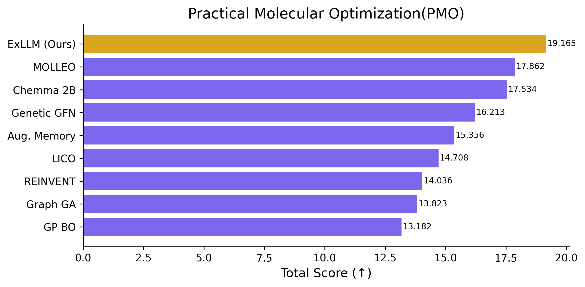
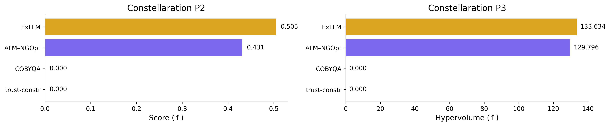
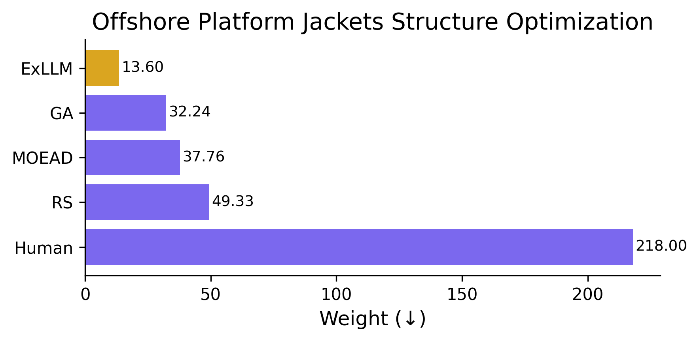
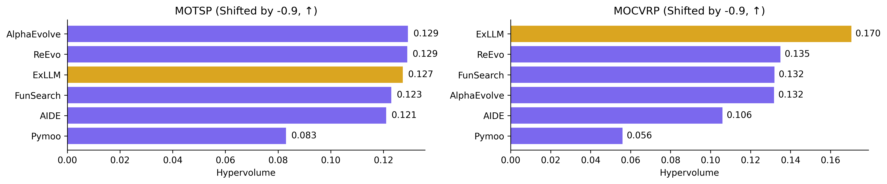

# ExLLM

This repository contains the source code and scripts for the ExLLM project. The project is organized as follows:

## Results
ExLLM serves as a general LLM-as-optimizer framework and achieves strong performance across 7 heterogeneous domains:
### Results

#### **Practical Molecular Optimization (PMO)**

Also 2nd place in Molecular Generation Challenge 2025 hosted by Sinopec.

---

#### **Circle Packing in a Unit Square**
| n | 26 | 27 | 28 | 29 | 30 | 31 | 32 |
|---|----|----|----|----|----|----|----|
| **Record** | 2.635977 (AlphaEvolve) | 2.685+ (Cantrell) | 2.737+ (Cantrell) | 2.790+ (Cantrell) | 2.842+ (Cantrell) | 2.889+ (Cantrell) | 2.937+ (AlphaEvolve) |
| **ExLLM** | **2.635983 (new record)** | 2.68598 | 2.73740 | 2.79034 | 2.84267 | 2.88997 | **2.939+ (new record)** |

--- 

#### **Stellarator Design, Constellation Benchmark**


---

#### **Offshore Platform Jacket Structural Optimization**


---

#### **Classical Multi-objective Routing (MOTSP / MOCVRP)**


--- 


#### **GCU kernel optimization**
Tencent Kaiwu AI competition 2025 (GCU track), Second prize.

---

#### **Peptide Design**


### Running the experiments
  - `python main.py molecules/goal5_gemini.yaml`: You need to define a config file to run, this is an example, you can use it as a template, the path is set to under the problem directory.
  - To resume training, just set `resume: True` in your config file. 


## Getting Started
To define a new optimization problem, you only need to create the following three files:

1. **`config.yaml`** – This file specifies the algorithm parameters for optimization.  
   📁 Example: `problem/molecules/config.yaml`

2. **`prompt_info.yaml`** – This file contains metadata, problem definitions, and textual descriptions.  
   A full tutorial is provided below.  
   📁 Example: `problem/molecules/prompt_info.yaml`

3. **`evaluator.py`** – This Python file defines how the generated solutions are evaluated. 
    A full tutorial is provided below.  
   📁 Example: `problem/molecules/evaluator.py`

# 🧬 YAML File Specification for Multi-Objective Molecular Optimization

This project uses a structured YAML format to define tasks for multi-objective molecular optimization. Each YAML file outlines the task description, output format, mutation/crossover guidelines, and optimization objectives. This format ensures consistency and clarity when interfacing with molecule generation and optimization models.

---

## 📁 File Structure Overview

A standard YAML file should contain the following fields:

| Field Name              | Required | Description |
|-------------------------|----------|-------------|
| `description`           | ✅       | A brief overview of the task; describe what the model should achieve |
| `example_output`        | ✅       | Defines the expected output format (must include `<candidate>` tags and your answer format) |
| `mutation_instruction`  | ⭕       | Suggested mutation operations to guide molecule structure changes |
| `crossover_instruction` | ⭕       | Suggested crossover operations (optional, can be left empty) |
| `other_requirements`    | ⭕       | Any additional constraints, e.g., "Molecules must be valid" |
| Optimization Objectives (e.g. `qed`, `sa`) | ✅ | One or more task-specific objectives, each described in a dedicated field |

---

## 📝 Example YAML File (problem/molecules/molecule.yaml)

```yaml
description: This task is to propose better molecules according to multiple objectives.

example_output: 'Each output new candidate must start with <candidate> and end with </candidate> in SMILES format. Example: <candidate>c1ccccc1</candidate>'

mutation_instruction: 'Example operations include:
  1. Modify functional groups
  2. Replace atoms or bonds
  3. Add/remove small substituents
  4. Ring modifications
  5. Stereochemistry changes
  6. Property-specific optimizations
  '

crossover_instruction: ''

other_requirements: The output molecules should be valid.

qed: QED (Quantitative Estimate of Drug-likeness) is a measure that quantifieshow
  'drug-like' a molecule is based on properties such as molecular weight,solubility,
  and the number of hydrogen bond donors and acceptors.Adding functional groups that
  improve drug-like properties (e.g., small molecular size,balanced hydrophilicity)
  can increase QED, while introducing large, complex, or highly polar groups can decrease
  it.
logp: LogP is the logarithm of the partition coefficient, measuring the lipophilicityor
  hydrophobicity of a molecule, indicating its solubility in fats versus water.Adding
  hydrophobic groups (e.g., alkyl chains or aromatic rings) increases LogP,while adding
  polar or hydrophilic groups (e.g., hydroxyl or carboxyl groups) decreases it.
```

# 📊 Evaluator Guide

In each specific problem directory under `problem/`, you need to create an `evaluator.py` file to define a custom evaluation logic. This file should contain a class named `RewardingSystem` that evaluates the quality of generated results.

---

## ✅ Required Structure

The `evaluator.py` file **must** define the following structure:

```python
def generate_initial_population(config,seed):
    # Arbitrary initial population, in strings form. The format should be consistent to the output format
    # The config and seed will be passed, you can use it or not
    return samples

class RewardingSystem:
    def __init__(self, config):
        # Initialization method (config is passed in)
        pass

    def evaluate(self, items):
        # Main evaluation function
        return items, log_dict
```

---
## Generate initial population

You are free to define the initial population. Each candidate must be a string, and its format must be consistent with what your evaluator expects. It is assumed these strings can be parsed and evaluated by your `evaluate` method.

## 🧩 Input and Output of `evaluate`

* **Input**: `items` is a list of Item objects (algorithm.base.Item). Each dictionary represents a result item to evaluate.
* **Each item must be given a dict containing the following keys**:

| Key                   | Description                                                                                                |
|----------------------|------------------------------------------------------------------------------------------------------------|
| `original_results`    | The raw metrics (e.g., `{'sa': 2.22, 'qed': 0.68}`). These are used for logging or visualization.          |
| `transformed_results` | The normalized and minimized version of the original results. Values must be in the `[0, 1]` range.        |
| `overall_score`       | A scalar value representing the overall quality of the item. Higher is better. This is fully customizable. |

* **Then simply use item.assign_results(results) to assign the result to each item**
* **If you want to change the value of an item, just use `item.value=xxx`**
### 🔸 Required Fields in `log_dict`

The `evaluate` function must return a second output: a dictionary called `log_dict` for tracking evaluation statistics. The following fields are **required**:

| Key            | Description                                                                 |
|----------------|-----------------------------------------------------------------------------|
| `invalid_num`  | Number of invalid candidates (e.g., failed parsing, wrong format, etc.)     |
| `repeated_num` | Number of duplicate candidates in the current generation                    |

If you do not compute these metrics in your task, simply return default values:

```python
log_dict = {
    "invalid_num": 0,
    "repeated_num": 0
}
```

---


## 🔄 About `transformed_results`

You need to manually normalize and transform the original results so they are suitable for multi-objective optimization. The general rules are:

1. **Normalization**: All values must be in the range `[0, 1]`.
2. **Minimization Format**: The optimization system assumes all objectives are "to minimize". You should convert maximization metrics accordingly.

### Example Transformation

Assume you are working with:

- **QED** (Quantitative Estimate of Drug-likeness): originally a maximization metric in `[0, 1]`  
  → Transformation: `1 - qed`
- **SA** (Synthetic Accessibility): originally a minimization metric, roughly in `[0, 10]`  
  → Transformation: `sa / 10`

```python
transformed_results = {
    'sa': original['sa'] / 10,
    'qed': 1 - original['qed']
}
```

---

## 📈 Defining `overall_score`

You must define a scalar score (`overall_score`) for each item. This value will be used for sorting and comparison — **the higher, the better**.

### Equal-weight example:

```python
overall_score = len(transformed_results) - np.sum(list(transformed_results.values()))
```

### Custom weighted example:

```python
weights = {'qed': 0.7, 'sa': 0.3}
overall_score = 1 - (weights['qed'] * transformed_results['qed'] +
                     weights['sa'] * transformed_results['sa'])
```

You are free to implement any custom scoring logic as long as the final result is a single float value.

---

## 📁 File Placement

Your `evaluator.py` file should be placed in the corresponding problem directory, example:

```
problem/
└── molecules/
    ├── evaluator.py  ✅
    └── config.yaml
```

---

## 🧪 Sample `evaluator.py` Template

```python
import numpy as np
class RewardingSystem:
    def __init__(self, config):
        self.config = config

    def evaluate(self, items):
        invalid_num = 0
        repeated_num = 0

        for item in items:
            original = item['original_results']

            transformed = {
                'sa': original['sa'] / 10,
                'qed': 1 - original['qed']
            }

            overall_score = len(transformed) - np.sum(list(transformed.values()))

            results = {
                'original_results': original,
                'transformed_results': transformed,
                'overall_score': overall_score
            }

            item.assign_results(results)

        log_dict = {
            'invalid_num': invalid_num,
            'repeated_num': repeated_num
        }

        return items, log_dict
```

---

## ❗Notes

- `evaluate()` modifies each `item` in-place.
- `transformed_results` must include normalized and minimization-converted values.
- `overall_score` must be a scalar float, with **higher values indicating better results**.
- You are free to extend the evaluation logic as needed per problem.

---
